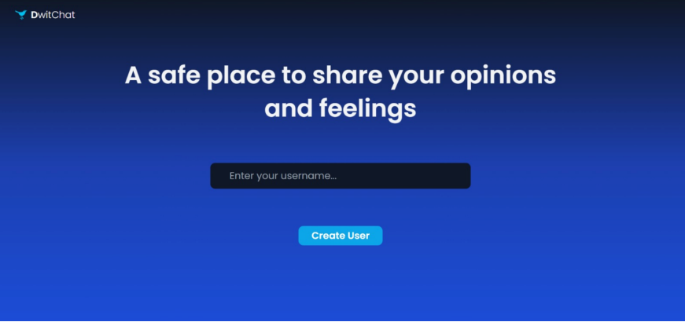
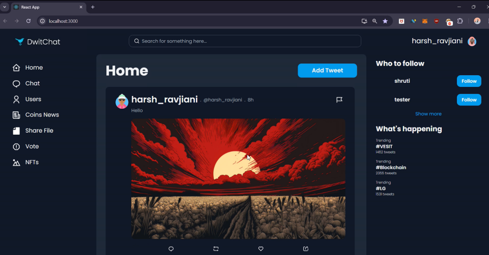

Overview

DwitChat is a decentralized social media platform built using blockchain technology to overcome the privacy, security, and control limitations of traditional centralized social networks. Centralized platforms store user data on proprietary servers, leading to risks such as data breaches, opaque moderation, censorship, and biased algorithms.

DwitChat adopts a decentralized architecture that empowers users with full control over their identity, content, and interactions. By leveraging the Ethereum blockchain and wallet-based authentication through MetaMask, the platform ensures transparency, data ownership, and secure peer-to-peer communication.

Key Features

Decentralized identity management using MetaMask (no centralized accounts)

Blockchain-backed transparency and immutability via Ethereum smart contracts

NFT-based content feeds ensuring ownership and authenticity

Direct tipping mechanism to reward content creators

Community-driven awards and engagement incentives

Decentralized censorship without a central authority

Decentralized storage to prevent data loss or unauthorized removal

Screenshots

### User login

### Home Feed

### Tester Tweets

### Hateful Tweets Example

### Analysing tweet photo using an AI tool

### Detecting hateful tweet and displaying a prompt message

###  Account details of the user after posting the tweet

### Coin Prices and transactions

Summary

DwitChat represents a shift toward a secure, transparent, and user-controlled social media ecosystem. 
By combining decentralized identity, blockchain-based content management, and community-driven incentives, 
the platform promotes a more open and democratic approach to digital social interaction.

Author

Jeet Soni
Harsh Ravjiani
Brijesh Ghonia
Yashi Jain
